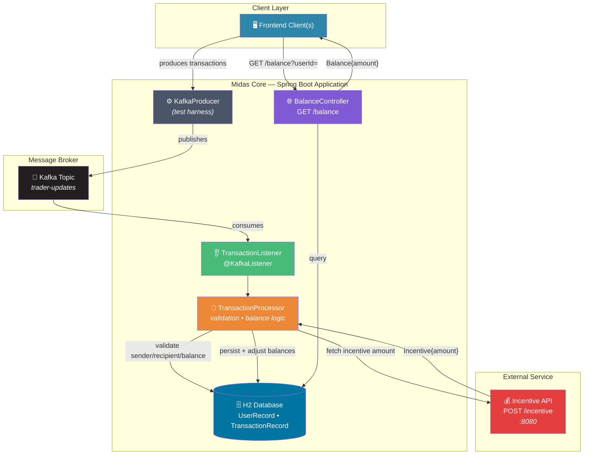
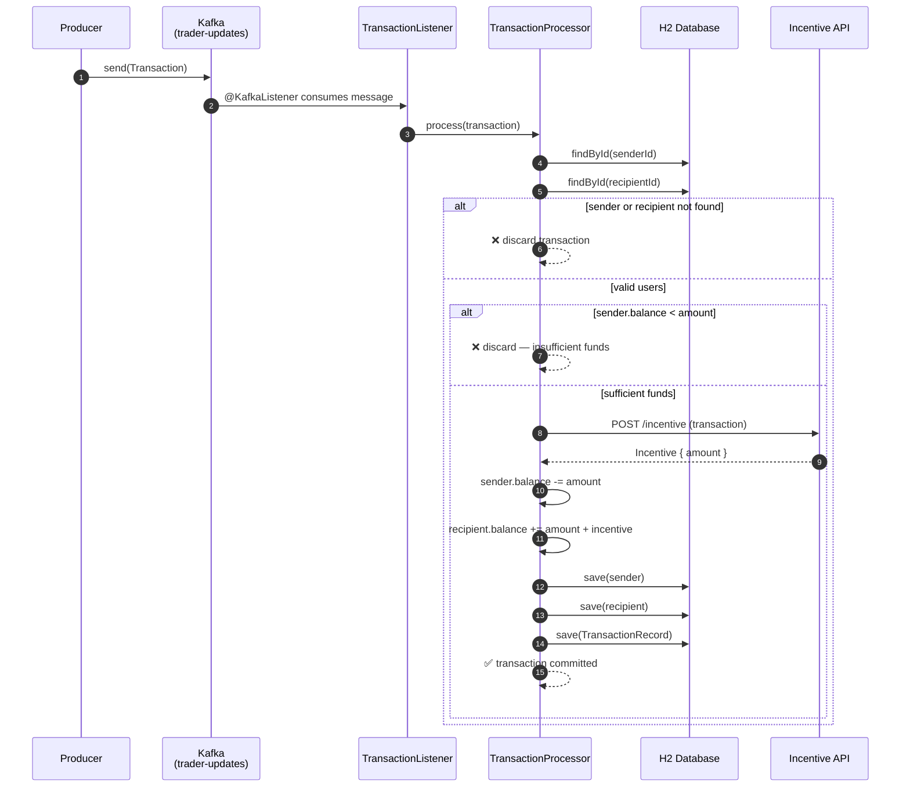
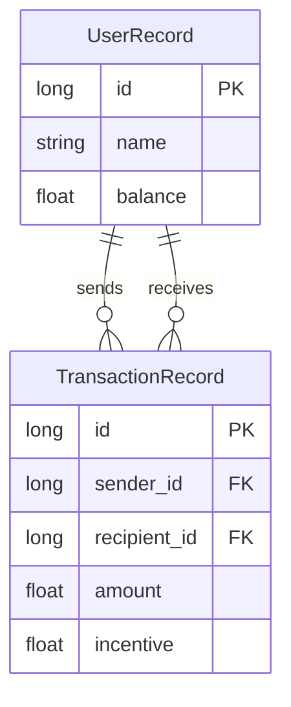
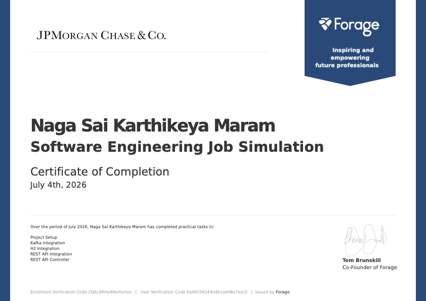

<div align="center">

# 🏛️ Midas Core

### *An Event-Driven Financial Transaction Processing Engine*

[](https://www.oracle.com/java/)
[](https://spring.io/projects/spring-boot)
[](https://kafka.apache.org/)
[](https://www.h2database.com/)
[](https://maven.apache.org/)

*A Spring Boot microservice built as part of the JPMorgan Chase Advanced Software Engineering Job Simulation — demonstrating asynchronous message processing, transactional data integrity, third-party REST integration, and API design.*

</div>

---

## 📖 Table of Contents

- [Overview](#-overview)
- [System Architecture](#-system-architecture)
- [Transaction Lifecycle](#-transaction-lifecycle)
- [Tech Stack](#-tech-stack)
- [Project Structure](#-project-structure)
- [Core Components](#-core-components)
- [Data Model](#-data-model)
- [Getting Started](#-getting-started)
- [API Reference](#-api-reference)
- [Testing](#-testing)
- [Design Decisions](#-design-decisions)
- [Roadmap](#-roadmap)

---

## 🔎 Overview

**Midas Core** is the backend nucleus of the *Midas* financial platform — a service responsible for ingesting, validating, persisting, and enriching monetary transactions between users in real time. It was designed to demonstrate how modern backend systems decouple producers and consumers of data using a message broker, while maintaining strict data integrity guarantees at the persistence layer.

At its heart, Midas Core answers one question millions of times a day at scale:

> *"Can this transaction happen, and if so, what does the world look like after it does?"*

The system consumes a continuous stream of transaction events from **Apache Kafka**, validates them against business rules, applies them atomically to an **H2** relational store, enriches successful transactions with dynamically computed incentives from an external **REST** service, and finally exposes the resulting account state through its own **RESTful API**.

---

## 🏗️ System Architecture



---

## 🔄 Transaction Lifecycle

The following sequence illustrates the full journey of a single transaction — from the moment it's produced to Kafka, to the moment its effects are queryable via the Balance API.



---

## 🧰 Tech Stack

<table>
<tr>
<td width="50%" valign="top">

### Core Framework
| Technology | Version | Purpose |
|---|---|---|
| ☕ **Java** | `17` | Language runtime |
| 🍃 **Spring Boot** | `3.2.5` | Application framework |
| 🗃️ **Spring Data JPA** | `3.2.5` | ORM / persistence abstraction |
| 🌐 **Spring Web** | `3.2.5` | REST controller support |

</td>
<td width="50%" valign="top">

### Messaging & Data
| Technology | Version | Purpose |
|---|---|---|
| 📨 **Spring Kafka** | `3.1.4` | Kafka producer/consumer integration |
| 🗄️ **H2 Database** | `2.2.224` | Embedded relational store |
| 🧪 **Testcontainers** | `1.19.1` | Kafka integration testing |
| 🔧 **Maven** | — | Build & dependency management |

</td>
</tr>
</table>

---

## 📁 Project Structure

```
forage-midas/
├── 📄 pom.xml
├── 📄 application.yml
├── 📁 services/
│   └── transaction-incentive-api.jar     # External incentive microservice
│
├── 📁 src/main/java/com/jpmc/midascore/
│   ├── MidasCoreApplication.java          # 🚀 Application entry point
│   │
│   ├── 📁 component/
│   │   ├── DatabaseConduit.java           # User persistence gateway
│   │   ├── IncentiveClient.java           # REST client → Incentive API
│   │   ├── TransactionListener.java       # 👂 Kafka consumer
│   │   └── TransactionProcessor.java      # 🧮 Validation & balance engine
│   │
│   ├── 📁 config/
│   │   └── KafkaConfig.java               # Producer/consumer factories
│   │
│   ├── 📁 controller/
│   │   └── BalanceController.java         # 🌐 GET /balance
│   │
│   ├── 📁 entity/
│   │   ├── UserRecord.java                # @Entity — user + balance
│   │   └── TransactionRecord.java         # @Entity — audit trail
│   │
│   ├── 📁 foundation/
│   │   ├── Transaction.java               # Kafka message payload (DTO)
│   │   ├── Balance.java                   # API response (DTO)
│   │   └── Incentive.java                 # Incentive API response (DTO)
│   │
│   └── 📁 repository/
│       ├── UserRepository.java
│       └── TransactionRepository.java
│
└── 📁 src/test/java/com/jpmc/midascore/
    ├── FileLoader.java                    # Test data ingestion helper
    ├── KafkaProducer.java                 # Test-harness producer
    ├── UserPopulator.java                 # Seeds users into H2
    ├── BalanceQuerier.java                # HTTP client for /balance
    └── TaskOneTests.java … TaskFiveTests.java
```

---

## 🧩 Core Components

### `TransactionListener`
The consumption boundary of the system. Annotated with `@KafkaListener`, it subscribes to the `trader-updates` topic and delegates every incoming `Transaction` to the processor — keeping message-broker concerns entirely separate from business logic.

### `TransactionProcessor`
The **transactional heart** of Midas Core. For every transaction, it enforces:

| Rule | Outcome if violated |
|---|---|
| ✅ Sender ID must resolve to an existing user | Transaction discarded |
| ✅ Recipient ID must resolve to an existing user | Transaction discarded |
| ✅ Sender balance ≥ transaction amount | Transaction discarded |

Upon passing validation, the processor calls out to the **Incentive API**, applies the resulting reward *exclusively to the recipient* (never deducted from the sender), and atomically persists both the updated user balances and an immutable `TransactionRecord` for audit purposes.

### `IncentiveClient`
A thin `RestTemplate`-based client that treats the Incentive API as a black box — POSTing the validated `Transaction` and deserializing the `Incentive` response, honoring the architectural principle that **the REST contract is the only coupling** between the two systems.

### `BalanceController`
A minimal, single-responsibility REST controller co-located within Midas Core (rather than extracted into a separate service), exposing account balances on a dedicated port (`33400`) with graceful handling of non-existent users (returns `Balance{amount=0}` rather than an error).

---

## 🗂️ Data Model



---

## 🚀 Getting Started

### Prerequisites

- ☕ Java 17 (`java -version`)
- 🔧 Apache Maven
- 🐳 Docker *(required by Testcontainers for Kafka-based tests)*

### 1️⃣ Clone & Configure

```bash
git clone https://github.com/your-username/forage-midas.git
cd forage-midas
```

### 2️⃣ Start the Incentive API

The Incentive API is bundled as a standalone executable JAR and must be running before transactions are processed:

```bash
java -jar services/transaction-incentive-api.jar
```

> 🟢 Listens on `localhost:8080` — keep this running in its own terminal session.

### 3️⃣ Build the Project

```bash
mvn clean install
```

### 4️⃣ Run the Application

```bash
mvn spring-boot:run
```

> 🟢 Midas Core's Balance API becomes available on `localhost:33400`.

---

## 📡 API Reference

### `GET /balance`

Retrieves the current balance for a given user.

| Parameter | Type | Location | Required | Description |
|---|---|---|---|---|
| `userId` | `long` | Query | ✅ | Unique identifier of the user |

<details>
<summary><strong>📥 Example Request</strong></summary>

```http
GET http://localhost:33400/balance?userId=3
```

</details>

<details>
<summary><strong>📤 Example Response</strong></summary>

```json
{
  "amount": 2567.52
}
```

</details>

> ℹ️ If `userId` does not correspond to an existing user, the endpoint gracefully returns `{"amount": 0.0}` rather than an HTTP error.

---

## 🧪 Testing

Midas Core's task-based test suite doubles as an integration harness, spinning up an **embedded Kafka broker** (via `@EmbeddedKafka`) alongside the full Spring application context for each task.

```bash
# Run the full test suite
mvn test

# Run a specific task's verification test
mvn -Dtest=TaskThreeTests test
```

| Test Class | Validates |
|---|---|
| `TaskOneTests` | Project scaffolding, dependency resolution, configuration |
| `TaskTwoTests` | Kafka producer/consumer wiring & message flow |
| `TaskThreeTests` | H2 persistence, transaction validation, balance mutation |
| `TaskFourTests` | Incentive API integration & recipient-only reward application |
| `TaskFiveTests` | REST balance query endpoint, non-existent user handling |

> ⚠️ Tasks Three through Five require the Incentive API (`transaction-incentive-api.jar`) to be running locally on port `8080`.

---

## 🧠 Design Decisions

<table>
<tr>
<th>Decision</th>
<th>Rationale</th>
</tr>
<tr>
<td><strong>Kafka as the messaging backbone</strong></td>
<td>Decouples frontend(s) from Midas Core, enables asynchronous processing under load bursts, and allows horizontal scaling of both producers and consumers without architectural changes.</td>
</tr>
<tr>
<td><strong>Separate <code>TransactionRecord</code> entity (rather than reusing <code>Transaction</code>)</strong></td>
<td>Preserves a clean separation between the wire-format DTO (deserialized from Kafka) and the persisted, relationally-linked audit entity — allowing each to evolve independently.</td>
</tr>
<tr>
<td><strong>Incentive API treated as an external black box</strong></td>
<td>Models a realistic microservice boundary: two teams, two codebases, one contract. As long as the REST interface holds, either side can change freely.</td>
</tr>
<tr>
<td><strong>Balance endpoint colocated within Midas Core</strong></td>
<td>A pragmatic tradeoff — the feature is minor enough that a new deployable service would introduce disproportionate operational overhead. Extraction remains an option once the surface area of exposed endpoints grows.</td>
</tr>
</table>

---

## 🗺️ Roadmap

- [ ] Externalize the Balance API into its own microservice once additional read endpoints are introduced
- [ ] Replace H2 with a production-grade RDBMS (PostgreSQL) for durability beyond the JVM lifecycle
- [ ] Introduce idempotency keys to guard against duplicate Kafka message delivery
- [ ] Add dead-letter topic handling for malformed or unprocessable transactions
- [ ] Expose Prometheus metrics for transaction throughput and rejection rates

---

## 🏅 Certification

<div align="center">



**Naga Sai Karthikeya Maram** — *Certificate of Completion, July 2026*
JPMorgan Chase & Co. Advanced Software Engineering Job Simulation, hosted on [Forage](https://www.theforage.com/)

</div>

---
<div align="center">

*Built as part of the JPMorgan Chase Advanced Software Engineering Virtual Experience Program on Forage.*

</div>
